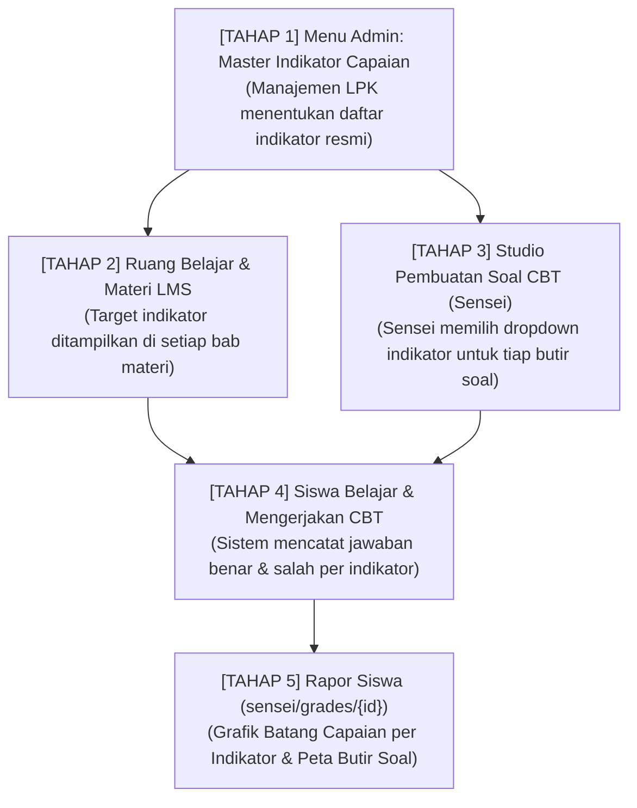

# ARSITEKTUR & ALUR KERJA: INDIKATOR CAPAIAN PEMBELAJARAN (LMS & CBT LPK)

Dokumen ini adalah dokumentasi resmi (**Master Blueprint**) mengenai alur kerja integrasi **Indikator Capaian Pembelajaran (Learning Outcome Indicators / 学習到達目標・評価指標)** mulai dari pengaturan di Admin, penyajian di Materi LMS, pengikatan pada Pembuatan Soal CBT, hingga kalkulasi grafik performa di Rapor Siswa.

---

## 1. Filosofi & Dasar Kebijakan

> **Prinsip Utama:**
> Setiap LPK memiliki target kurikulum dan kompetensi kerja yang spesifik. Oleh karena itu, **Indikator Capaian Pembelajaran tidak boleh dibuat berdasarkan asumsi otomatis/kaku oleh sistem**, melainkan **didefinisikan dan dikendalikan sepenuhnya oleh Manajemen LPK dan Sensei (Instruktur)**.

Indikator ini menjadi **jembatan penghubung** antara:
1. Apa yang **diajarkan** di materi bab (LMS).
2. Apa yang **diuji** dalam butir-butir soal (CBT).
3. Apa yang **dievaluasi** pada laporan kemahiran siswa (Rapor Siswa).

---

## 2. Diagram Alur Kerja 5 Tahap (End-to-End Workflow)

---

## 3. Rincian Alur di Setiap Titik Antarmuka

### Tahap 1: Pengaturan di Menu Admin (`/admin/master/learning-indicators`)
* **Pengelola**: Admin / Staf Kurikulum LPK / Kepala Sensei.
* **Tujuan**: Mendaftarkan standar indikator capaian kompetensi bahasa Jepang LPK.
* **Atribut Indikator**:
  1. **Kode Indikator**: Contoh: `IND-BUN-01`, `IND-GOI-04`, `IND-CHOU-02`.
  2. **Nama Indikator**: Contoh: *Penguasaan Partikel Dasar (wa, ga, ni, de, wo)*, *Kosakata Dunia Kerja & Pabrik*, *Konjugasi Kata Kerja Bentuk-Te*.
  3. **Level Pembelajaran**: `N5` (Dasar), `N4` (Standar Kerja SSW/Magang), `N3` (Menengah).
  4. **Seksi / Bidang Kemampuan**:
     - *Moji & Goi* (Huruf & Kosakata)
     - *Bunpou* (Tata Bahasa)
     - *Dokkai* (Pemahaman Bacaan)
     - *Choukai* (Pendengaran / Listening)
  5. **Kaitan Bab Materi**: Opsional dikaitkan dengan bab pembelajaran tertentu (Bab 1–50).
  6. **Deskripsi Kompetensi**: Penjelasan tolok ukur apa yang harus mampu dilakukan siswa.

---

### Tahap 2: Ditampilkan di Menu Materi Pembelajaran LMS
* **Lokasi**: 
  - Editor Materi Sensei: `/sensei/lms/{chapter_id}`
  - Ruang Belajar Siswa: `/siswa/lms/{chapter_id}`
* **Penyajian**:
  - Di bagian atas modul bab materi, terdapat kotak info:
    **"🎯 Target Indikator Capaian Bab Ini:"**
    - [ ] Mampu memahami fungsi partikel *ni* untuk penunjuk waktu dan tujuan.
    - [ ] Menguasai 35 kosakata baru terkait fasilitas umum dan lokasi.
  - Membantu siswa memahami tujuan belajar dan membantu Sensei menyusun materi yang tepat sasaran.

---

### Tahap 3: Dropdown Pilihan pada Pembuatan Soal CBT (`/sensei/questions/create`)
* **Pengelola**: Sensei Pembuat Soal.
* **Tujuan**: Memastikan setiap butir soal memiliki tolok ukur kompetensi yang jelas.
* **Mekanisme**:
  - Pada form pembuatan soal (baik paket soal maupun butir satuan), terdapat dropdown wajib:
    **`🎯 Indikator Capaian Pembelajaran *`**
  - Opsi dropdown otomatis menarik data aktif dari master indikator yang telah dibuat oleh Admin pada Tahap 1.
  - Contoh: Saat membuat soal partikel kalimat `わたしは 7じ( ) おきます。`, Sensei memilih indikator: `[N5] Penguasaan Partikel Dasar (wa, ga, ni, de, wo)`.

---

### Tahap 4: Pencatatan Jawaban Siswa saat Ujian CBT
* **Pengguna**: Siswa Trainee LPK.
* **Mekanisme di Balik Layar**:
  - Saat siswa menjawab soal CBT, sistem menyimpan relasi:
    $$\text{Sesi Ujian} \longrightarrow \text{Butir Soal} \longrightarrow \text{Indikator Capaian} \longrightarrow \text{Status Jawaban (Benar / Salah)}$$
  - Nilai skor yang diperoleh siswa secara otomatis dialokasikan ke keranjang indikator terkait.

---

### Tahap 5: Grafik & Evaluasi Capaian di Rapor Siswa (`/sensei/grades/{student_id}`)
* **Pengguna**: Sensei & Manajemen LPK.
* **Tampilan UI/UX**:
  
#### A. Grafik Batang Capaian per Indikator (Achievement Progress Bar)
Menghitung persentase ketuntasan nilai siswa pada tiap-tiap indikator:
$$\text{Persentase Capaian} = \left( \frac{\text{Skor Benar yang Diperoleh pada Indikator}}{\text{Total Skor Maksimal Soal pada Indikator}} \right) \times 100\%$$

**Kategori Status Kelulusan Indikator:**
| Rentang Nilai | Status (Indonesia) | Status (Jepang / JP Mode) | Warna Indikator | Tindak Lanjut Sensei |
| :---: | :--- | :--- | :---: | :--- |
| **$\ge$ 80%** | **Tuntas / Mahir** | 合格・習得 (Goukaku) | 🟢 Hijau Emerald | Siswa siap melangkah ke bab berikutnya. |
| **60% – 79%** | **Cukup / Perlu Latihan** | 普通・要復習 (Futsuu) | 🟡 Kuning Amber | Berikan latihan tambahan mandiri. |
| **< 60%** | **Belum Tuntas (Lemah)** | 未達・要個別指導 (Mitatsui) | 🔴 Merah Rose | **Wajib bimbingan khusus / remedial** sebelum ujian resmi N4. |

#### B. Peta Butir Soal (Question Mastery Matrix Grid)
- Setiap kotak nomor soal menampilkan badge indikator capaiannya.
- Sensei dapat langsung melihat: *"Siswa ini salah di nomor 4, 7, dan 12 yang seluruhnya menguji Indikator Konjugasi Bentuk-Te"*.
- Diagnosa kelemahan siswa menjadi **100% akurat dan berbasis data ilmiah**.

---

## 4. Matriks Hak Akses (Role Responsibility)

| Fitur / Komponen | Admin LPK | Sensei | Siswa |
| :--- | :---: | :---: | :---: |
| **Kelola Master Indikator Capaian** (CRUD) | ✅ **Pemilik Utama** | 👁️ Melihat & Mengusulkan | ❌ Tidak Ada Akses |
| **Melihat Target Indikator di Bab LMS** | 👁️ Melihat | ✅ Menautkan ke Bab | 👁️ Melihat Target Belajar |
| **Memilih Indikator saat Buat Soal CBT** | 👁️ Melihat | ✅ **Wajib Memilih** | ❌ Tidak Ada Akses |
| **Mengerjakan Soal Berindikator** | ❌ | ❌ | ✅ **Mengerjakan** |
| **Melihat Grafik Capaian per Indikator** | 👁️ Laporan Global | ✅ **Analisis & Remedial** | 👁️ Evaluasi Mandiri di Rapor |

---

*Dokumen ini disimpan permanen sebagai panduan acuan standar implementasi fitur di lingkungan Sistem LMS & CBT LPK.*
